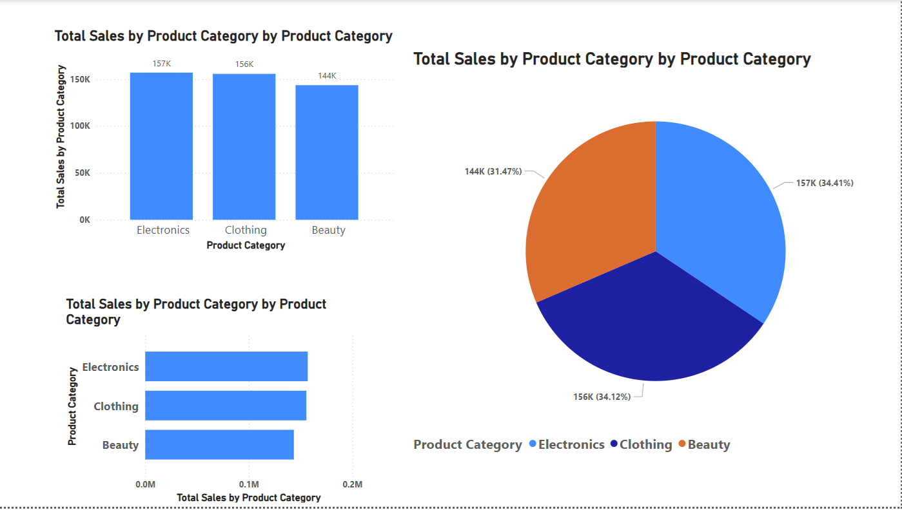

# Retail Sales Data Analysis - Power BI Dashboard

## Introduction
This project provides an analytical dashboard for retail sales data using **Power BI**. The dashboard helps businesses track **total sales, revenue, profit, and regional performance** over time.

## Features
- **Sales Performance Analysis:** Displays total sales, revenue, and profit trends.
- **Product Category Insights:** Identifies best-selling and low-performing products.
- **Regional Sales Distribution:** Visualizes revenue from different geographic locations.
- **Dynamic Filtering:** Enables filtering of sales by date, product category, and region.

## Dataset
- **Source:** Retail Sales CSV file (`RetailSalesData.csv`)
- **Size:** Over 10,000 transactions
- **Columns Included:**
  - **Date:** Transaction date
  - **Product Name:** Name of the product
  - **Category:** Product category (Electronics, Clothing, etc.)
  - **Revenue:** Total sales revenue
  - **Cost:** Cost price of the product
  - **Profit:** Sales amount - Cost
  - **Region:** Sales location

## Technologies Used
- **Power BI** - Data visualization & reporting
- **SQL** - Data cleaning & transformation
- **Excel** - Initial data preparation

## Use Cases
This dashboard can be used by:
- **Retail business owners** to monitor sales trends.
- **Marketing analysts** to identify product performance.
- **Finance teams** to assess profitability and revenue distribution.

## Dashboard Overview

## How to Run This Project
1. **Download the Dataset**  
   [RetailSalesData.csv](link-to-dataset)
2. **Open Power BI and load the dataset**  
3. **Use the provided Power BI template to generate insights**  
4. **Apply filters to explore specific sales trends**  

---

